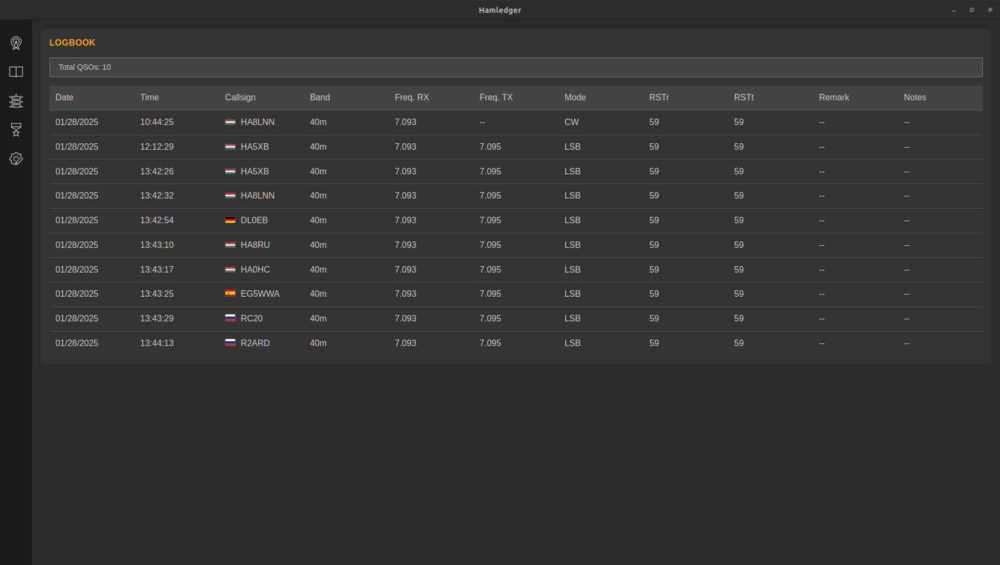
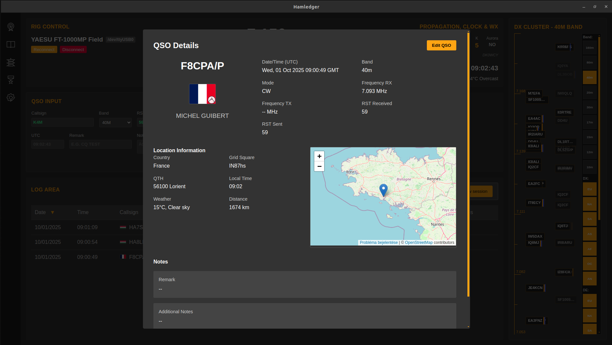

<p align="center">
  
</p>

# Hamledger

_If you find my work valuable, please consider to Sponsor or Donate!_

**Hamledger** is a modern amateur radio logging app built with Vue 3, TypeScript, and Electron.  
Fast daily logging, serious contesting, and a polished UI that stays out of your way.

---

## Highlights (Quick Tour)

### 1) Everyday logging that feels instant




- Fast QSO entry with rich station details
- Clean log area with filters and sorting
- Detailed QSO view with map and station info

### 2) DX cluster at a glance


- High‑density spot visualization
- Quick station selection right from the cluster

### 3) Contest mode built for flow


- Dedicated contest workflow with sessions, multipliers, and speed dial
- Session statistics modal with map and detailed QSO list

### 4) Awards & achievements


- Track award progress and operating milestones

### 5) Voice & CW keyer


- Record clips, build messages, and assign hotkeys
- Winkeyer‑compatible CW workflow

### 6) Hotkeys at your fingertips


- Visible hotkey strip with queue‑aware status

---

## Core Features

- **Real-time Rig Control** (Hamlib)
- **QSO Logging** with auto‑fill + ADIF import/export
- **DX Cluster** selection and visualization
- **Contest Mode** with sessions, speed dial, multipliers, and stats
- **Awards** tracking
- **Voice & CW Keyer** with hotkeys
- **Propagation + Weather** panels
- **WSJT‑X Integration**
- **Modern UI** optimized for fast operating

---

## Documentation

For detailed usage instructions and complete functionality guide, see:
- [Tutorial (Hungarian)](TUTORIAL.md) - Teljes funkcionalitás útmutató magyar nyelven
- [Tutorial (English)](TUTORIAL_EN.md) - Complete functionality guide in English

---

## Installation

See [INSTALL.md](INSTALL.md) for detailed installation instructions.

---

## Getting Started with Development

### Prerequisites

- Node.js (v16 or later)
- pnpm package manager
- Git

### Installation

1. Clone the repository:

   ```bash
   git clone https://github.com/valibali/hamledger.git
   ```

2. Install dependencies:

   ```bash
   pnpm install
   ```

3. Start the development server:
   ```bash
   pnpm run app:dev
   ```

### Building for Production

1. Build the application:

   ```bash
   pnpm run app:build
   ```

2. Preview the production build:
   ```bash
   pnpm run app:preview
   ```

---

## Development

### Project Structure

```
hamledger/
├── src/
│   ├── components/     # Vue components
│   ├── store/         # Pinia stores
│   ├── electron/      # Electron main and preload scripts
│   └── assets/        # Static assets
```

### Contributing

1. Fork the repository
2. Create your feature branch (`git checkout -b feature/AmazingFeature`)
3. Commit your changes (`git commit -m 'Add some AmazingFeature'`)
4. Push to the branch (`git push origin feature/AmazingFeature`)
5. Open a Pull Request

---

## License

This project is licensed under the [GNU General Public License v3.0](LICENSE) with commercial clause. See the [LICENSE](LICENSE) file for details.

---

## Acknowledgments

- The Vue.js team for the amazing framework
- The Electron team for making cross-platform desktop apps possible
- The amateur radio community for inspiration and feedback

All the best,  
HA5XB Balazs
