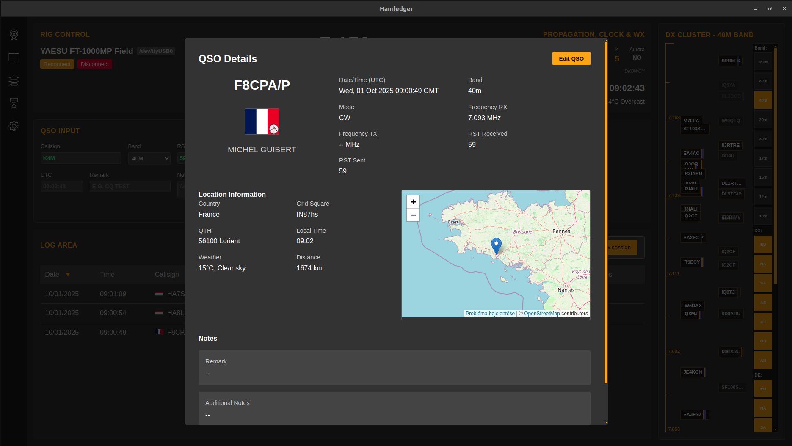

# HamLedger Tutorial - Teljes Funkcionalitás Útmutató

## Fejlesztési Állapot

**Fontos megjegyzés**: A HamLedger jelenleg fejlesztés alatt áll, de már teljesen alkalmas mindennapi QSO naplózásra. Az alapvető funkciók stabilak és megbízhatóak, míg néhány speciális funkció még finomhangolás alatt áll.

## Tartalomjegyzék

1. [Bevezetés](#bevezetés)
2. [Kezdeti Beállítás](#kezdeti-beállítás)
3. [Főképernyő Áttekintés](#főképernyő-áttekintés)
4. [QSO Bevitel](#qso-bevitel)
5. [Távoli Állomás Információk](#távoli-állomás-információk)
6. [Rig Vezérlés (CAT Control)](#rig-vezérlés-cat-control)
7. [Frekvencia és S-Meter](#frekvencia-és-s-meter)
8. [Propagációs Adatok, Óra és Időjárás](#propagációs-adatok-óra-és-időjárás)
9. [DX Cluster](#dx-cluster)
10. [Napló Terület](#napló-terület)
11. [Naplókönyv](#naplókönyv)
12. [QSL Kártya Kezelés](#qsl-kártya-kezelés)
13. [ADIF Import/Export](#adif-importexport)
14. [WSJT-X Integráció](#wsjt-x-integráció)
15. [Konfigurációs Beállítások](#konfigurációs-beállítások)
16. [Díjak és Statisztikák](#díjak-és-statisztikák)
17. [Hibaelhárítás](#hibaelhárítás)

## Bevezetés

A HamLedger egy modern, Electron-alapú amatőr rádió naplózó alkalmazás, amely átfogó funkcionalitást biztosít a QSO-k kezeléséhez, rig vezérléshez és DX cluster integrációhoz. Az alkalmazás intuitív felületet kínál minden szintű rádióamatőr számára, és tökéletesen alkalmas mindennapi használatra.

### Főbb Jellemzők

- **Modern felhasználói felület**: Vue.js alapú, reszponzív design
- **CAT Control**: Hamlib alapú rig vezérlés
- **DX Cluster integráció**: Valós idejű spot információk
- **QRZ.com integráció**: Automatikus állomás információ lekérdezés
- **ADIF támogatás**: Import/export funkcionalitás
- **QSL kártya kezelés**: Automatikus címke generálás
- **WSJT-X integráció**: Digitális módok támogatása
- **Propagációs adatok**: Valós idejű ionoszféra információk

## Kezdeti Beállítás

### Setup Wizard

Az alkalmazás első indításakor egy 6 lépéses beállítási varázsló vezeti végig a konfigurációs folyamaton. Minden lépésben csak a szükséges információkat kell megadni, a varázsló automatikusan validálja az adatokat és segít a helyes beállításokban.

#### 1. lépés: Állomás Információk
Írd be a hívójeledet (automatikusan nagybetűsre konvertálódik) és a QTH-t (pl. Budapest, Hungary). Ezek az alapvető adatok szükségesek a QSO naplózáshoz és a QSL kártyák generálásához.

#### 2. lépés: Kiegészítő Információk
Add meg a Maidenhead locator-t (pl. JN97) - ez opcionális, de hasznos a távolság számításokhoz. Válaszd ki az IARU régiót (1, 2 vagy 3) a megfelelő sávtervek használatához.

#### 3. lépés: Sávválasztás
Jelöld be azokat a sávokat, amelyeken működni szeretnél. A gyors kiválasztás gombokkal ("All HF", "VHF/UHF", "Clear All") egyszerűen beállíthatod a preferenciáidat.

#### 4. lépés: ADIF Import
Ha van meglévő naplód, itt importálhatod ADIF formátumban. A progress bar mutatja az előrehaladást, és részletes visszajelzést kapsz az importálás eredményéről.

#### 5. lépés: QRZ.com Konfiguráció
Add meg a QRZ.com felhasználóneved és jelszavad az automatikus állomás információ lekérdezéshez. Az adatok biztonságosan, titkosítva tárolódnak a helyi gépen.

#### 6. lépés: CAT Control Beállítás
Windows rendszeren az "Install Hamlib" gombbal automatikusan telepítheted a szükséges komponenseket. Linux rendszeren kövesd az útmutatót a csomagkezelő használatához és a dialout csoport beállításához.

## Főképernyő Áttekintés

### Navigációs Oldalsáv

A bal oldali navigációs sáv négy fő nézetet biztosít egyszerű ikonokkal. Kattints a megfelelő ikonra a nézetek közötti váltáshoz: QSO nézet (📡), Naplókönyv (📖), Díjak (🏆), és Beállítások (⚙️).

### Főképernyő Elrendezés

A QSO nézet három fő területre oszlik optimális munkavégzéshez. A bal oszlop tartalmazza a QSO beviteli mezőket és a napló területet, a jobb oszlop a DX Cluster-t, míg a felső header sáv a rig vezérlést és státusz információkat.

## QSO Bevitel

### Beviteli Mezők Használata

Írd be a hívójelet a felső mezőbe - automatikusan nagybetűsre konvertálódik és valós időben validálódik. Ha CAT vezérlés aktív, a sáv és frekvencia automatikusan kitöltődik a rig aktuális beállításai alapján.

#### RST Jelentések és Időadatok
Az RST mezők alapértelmezetten "59"-re állnak phone módoknál, CW-nél "599"-re. A dátum és idő automatikusan UTC-ben frissül, de szükség esetén manuálisan is módosítható.

#### Megjegyzések Hozzáadása
A "Remark" mezőbe írhatsz rövid megjegyzést (pl. "CQ Test"), a "Notes" mezőbe pedig részletesebb információkat. Ezek a mezők opcionálisak, de hasznosak a QSO-k későbbi azonosításához.

### QSO Hozzáadás

Három egyszerű módszer áll rendelkezésre QSO hozzáadásához: kattints az "Add QSO" gombra, nyomj Enter-t a hívójel mezőben, vagy használd a WSJT-X automatikus naplózást. A QSO hozzáadása után a mezők automatikusan törölődnek az új QSO beviteléhez.

## Távoli Állomás Információk

### Automatikus Információ Lekérdezés

A hívójel bevitele után 500ms késleltetéssel automatikusan lekérdezi az állomás adatait QRZ.com-ról és egyéb forrásokból. Az információk a jobb oldali panelen jelennek meg, beleértve a nevet, címet, grid locator-t és QSL státuszt.

### Földrajzi és Időjárási Adatok
A rendszer automatikusan kiszámítja a távolságot és irányt a távoli állomáshoz, valamint megjeleníti a helyi időt és időjárást. Ha a hívójel /P, /M vagy /MM utótagot tartalmaz, a rendszer felismeri a hordozható működést.

### Hibaelhárítás
Ha a QRZ.com lekérdezés sikertelen, a hívójel mező piros kerettel jelzi a problémát. Ellenőrizd a QRZ.com beállításokat a Settings menüben, vagy használd az alkalmazást offline módban helyi adatokkal.

## Rig Vezérlés (CAT Control)

### Beállítás és Kapcsolódás

A CAT vezérlés beállításához menj a Settings menübe és válaszd ki a rig modellt a listából. Add meg a COM port-ot (Windows: COM3, Linux: /dev/ttyUSB0) és kattints a Connect gombra a kapcsolat létrehozásához.

### Automatikus Szinkronizálás
A sikeres kapcsolat után a HamLedger automatikusan követi a rádió frekvenciáját és módját. A rig-en végzett változtatások azonnal megjelennek az alkalmazásban, és automatikusan frissítik a QSO beviteli mezőket.

### Hibaelhárítás
Ha a kapcsolat nem jön létre, ellenőrizd hogy a Hamlib telepítve van-e (Windows: automatikus telepítés, Linux: `sudo apt install libhamlib-utils`). Linux rendszeren add hozzá a felhasználót a dialout csoporthoz: `sudo usermod -a -G dialout $USER`.

## Frekvencia és S-Meter

### Frekvencia Megjelenítés

A frekvencia nagy számjegyekkel jelenik meg MHz-ben, kattintásra szerkeszthető input mezővé válik. A SPLIT gomb aktiválásával külön TX frekvenciát állíthatsz be, amely zárójelben jelenik meg.

### S-Meter Használata
Az S-meter hagyományos S1-S9 skálát használ, S9 felett +20, +40, +60 dB jelzéssel. A színkódolás fehértől narancsig változik a jelerősség függvényében, és gyártó-specifikus kalibrálást támogat.

### Mód Választás
A támogatott módok között LSB, USB, CW és digitális módok (DATA, FT8, FT4, PSK31) találhatók. A mód automatikusan válthat a frekvencia alapján, vagy manuálisan is beállítható.

## Propagációs Adatok, Óra és Időjárás

### Propagációs Információk

A felső sávban látható propagációs adatok valós idejű ionoszféra információkat mutatnak WWV/WWVH forrásból. Az SFI (napfolt index), A-index és K-index színkódolással jelzi a propagációs viszonyokat: zöld = jó, narancs = közepes, piros = rossz.

### UTC Óra és Helyi Időjárás
A pontos UTC idő másodperces frissítéssel jelenik meg a QSO naplózáshoz. A helyi időjárás automatikusan frissül a Maidenhead locator alapján, megjelenítve a hőmérsékletet és időjárási viszonyokat.

## DX Cluster

### Spot Megjelenítés és Navigáció

A DX Cluster vertikális frekvencia skálát használ, ahol minden spot a pontos frekvenciája alapján pozicionálódik. A spotok két oszlopban jelennek meg életkor alapú átlátszósággal, zöld keret jelzi a már dolgozott állomásokat.

### Nagyító Funkció és Szűrés
Vigye az egérmutatót egy spot fölé a nagyító ablak megjelenítéséhez, amely ±5 kHz tartományban mutatja az összes spotot. A jobb oldali szűrő panelen sáv, kontinens (DX/DE) és mód szerint szűrheted a spotokat.

### Spot Kattintás és Integráció
Kattints egy spotra a rig automatikus beállításához és a hívójel QSO formba való betöltéséhez. A rendszer automatikusan beállítja a frekvenciát, módot és elindítja a QRZ.com lekérdezést az állomás információinak megszerzéséhez.

## Napló Terület

### Aktuális Session

A napló terület táblázatos formában mutatja az aktuális session QSO-it dátum, idő, hívójel, sáv és mód oszlopokkal. Az ország zászlók automatikusan megjelennek a hívójelek mellett, a sorok kattinthatók a QSO részletek megnyitásához.

### Szűrési és Rendezési Lehetőségek
Az oszlop fejlécekre kattintva rendezheted a listát, a "Show/Hide Filters" gombbal pedig szűrő panelt nyithatsz meg. Szűrhetsz hívójel, sáv, mód vagy dátum tartomány szerint, wildcard (*,?) és regex támogatással.

### Statisztikák
A napló terület alján látható az aktuális session QSO-inak száma, az összes QSO szám és a szűrt eredmények száma. Ez segít nyomon követni a napi aktivitást és a napló méretét.

## Naplókönyv

### Teljes Napló Kezelés

A Naplókönyv nézet virtuális scrolling-ot használ nagy adatmennyiség hatékony megjelenítéséhez 50 QSO-s batch-ekben. Kattints bármelyik QSO sorra a részletes nézet megnyitásához, amely minden információt megjelenít az adott QSO-ról.

### Batch Műveletek
A "Batch Select" gombbal aktiválhatod a többszörös kiválasztás módot, amely checkbox oszlopot ad minden sorhoz. Használd a "Select all visible" és "Clear selection" gombokat a gyors kiválasztáshoz, majd végezz tömeges műveleteket: QSL státusz változtatás, export vagy törlés.

### QSO Szerkesztés és Törlés
A QSO részletek dialógban az "Edit QSO" gombbal szerkesztési módba váltasz, ahol minden mező módosítható. A "Save Changes" gomb elmenti a változtatásokat, a "Delete QSO" gomb pedig megerősítés után véglegesen törli a QSO-t.

## QSL Kártya Kezelés

### QSL Státusz Rendszer

A QSL státusz egyszerű betűkódokkal és színkódolással jelzi a QSL kártya állapotát: N (piros) = nincs, P (narancs) = nyomtatásra vár, L (kék) = kinyomtatva, S (sárga) = elküldve, R (zöld) = megérkezett, B (kék) = mindkét irányban rendben. Bal egérgombbal előre, jobb egérgombbal visszafelé léphetsz a státuszok között.

### Automatikus Címke Generálás
Amikor a státuszt "P"-re állítod, a rendszer automatikusan felajánlja a QSL címke PDF generálását QRZ.com adatok alapján. A sikeres generálás után a státusz automatikusan "L"-re vált, és megnyílik a PDF fájl nyomtatáshoz.

### Batch Címke Generálás
A LogBook nézetben batch módban több QSO-t kiválasztva egyszerre generálhatsz címkéket. A progress bar mutatja az előrehaladást, és az "Open Folder" gombbal megnyithatod a generált PDF fájlokat tartalmazó mappát.

## ADIF Import/Export

### Import Funkció

Az ADIF import a Settings menüből vagy a setup wizard során érhető el .adi és .adif fájlokhoz. Válaszd ki a fájlt a natív böngészővel, az előnézet megmutatja a QSO számokat, majd a progress bar követi a valós idejű importálást.

### Export Funkció
A LogBook nézetben három export opció közül választhatsz: teljes napló, szűrt eredmények vagy kiválasztott QSO-k batch módban. Az export dialog előnézetet mutat a QSO számokról, majd natív fájl mentés dialógot nyit meg.

### ADIF Kompatibilitás
A HamLedger teljes ADIF 3.1.0 kompatibilitást biztosít UTF-8 kódolással. A dátum YYYYMMDD, az idő HHMMSS formátumban exportálódik, minden szabványos mezővel együtt.

## WSJT-X Integráció

### Konfiguráció és Aktiválás

A Settings menüben engedélyezd a WSJT-X integrációt és állítsd be az UDP portot (alapértelmezetten 2237). Az "Auto Log" opció automatikusan naplózza a megerősített QSO-kat, a "Log Only Confirmed" csak a teljes QSO-kat rögzíti.

### CAT Control Átadás
A "Hand over to WSJT-X" gombbal átadhatod a CAT vezérlést a WSJT-X-nek, amely automatikusan leállítja a rigctld-t és elindítja az UDP listener-t. A kék státusz jelzi hogy a WSJT-X mód aktív.

### Automatikus Naplózás és Visszavétel
A WSJT-X automatikusan küldi a QSO adatokat UDP-n keresztül, amelyek azonnal megjelennek a HamLedger naplójában. A CAT vezérlés visszavételéhez kapcsold ki a WSJT-X CAT funkcióját, majd kattints a "Take back control" gombra.

## Konfigurációs Beállítások

### Beállítások Elérése

A Settings menü (⚙️ ikon) kategóriákba rendezett konfigurációs lehetőségeket biztosít. Minden kategória valós idejű validációval és hibaüzenetekkel segíti a helyes beállítást.

### Főbb Kategóriák
A Station kategóriában állítsd be a hívójelet, QTH-t és grid locator-t. A CAT Control részben konfiguráld a rig modellt és COM portot, az Online Services-ben pedig a QRZ.com hozzáférést.

### Platform Specifikus Segítség
Windows rendszeren automatikus Hamlib telepítés és tűzfal konfiguráció érhető el. Linux rendszeren részletes telepítési útmutatók és sudo parancsok segítik a beállítást, beleértve a dialout csoport konfigurációt.

## Díjak és Statisztikák

### Fejlesztés Alatt

A Díjak nézet jelenleg "Not yet available" üzenetet mutat, mivel ez a funkció még fejlesztés alatt áll. A jövőben DXCC progress követés, WAS és WAZ díjak számítása, valamint részletes QSO statisztikák lesznek elérhetők.

### Tervezett Funkciók
A tervezett funkciók között szerepel az országok státuszának követése, díj progress megjelenítés grafikus formában, és átfogó statisztikák a QSO aktivitásról. Ez a funkció a későbbi verziókban lesz elérhető.

## Hibaelhárítás

### Gyakori Problémák

**CAT Control**: Ha "rigctld not found" hibaüzenet jelenik meg, ellenőrizd a Hamlib telepítést és a PATH beállítást. "Connection refused" esetén ellenőrizd a port foglaltságot és tűzfal beállításokat.

**QRZ.com Integráció**: Authentication failed hiba esetén ellenőrizd a felhasználónév/jelszó párost és a hálózati kapcsolatot. Rate limiting esetén csökkentsd a lekérdezések gyakoriságát.

**WSJT-X Integráció**: UDP kommunikációs problémák esetén ellenőrizd a port konfliktusokat és tűzfal beállításokat. Győződj meg róla hogy a WSJT-X ugyanazt a portot használja.

### Diagnosztika és Támogatás

Nyisd meg a Developer Tools-t (F12) a Console és Network tabok segítségével a hibák diagnosztizálásához. A beállítások és adatbázis fájlok a userData mappában találhatók.

A GitHub repository-ban találsz részletes dokumentációt, hibabejelentési lehetőséget és közösségi támogatást. A funkciók folyamatosan fejlődnek, ezért érdemes rendszeresen ellenőrizni a frissítéseket.

---

*Ez a tutorial a HamLedger alkalmazás teljes funkcionalitását lefedi. Az alkalmazás jelenleg fejlesztés alatt áll, de teljesen alkalmas mindennapi QSO naplózásra.*
