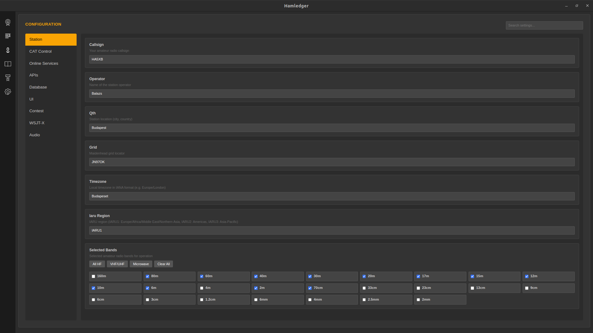
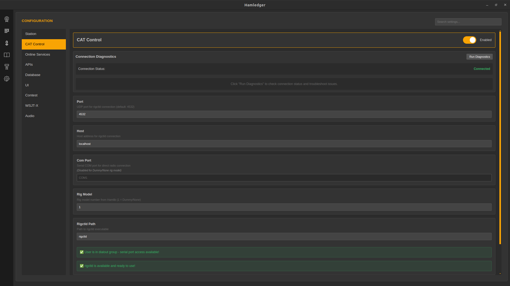
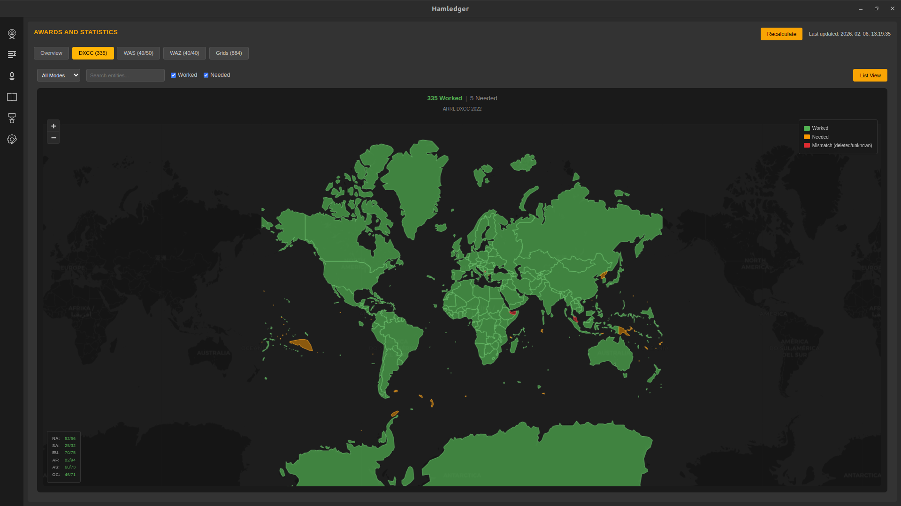
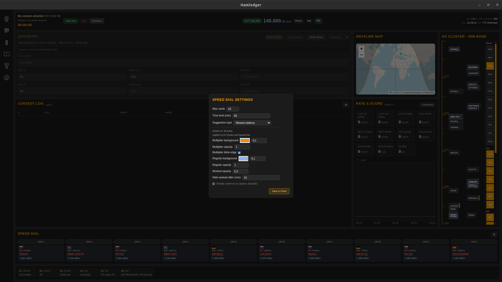
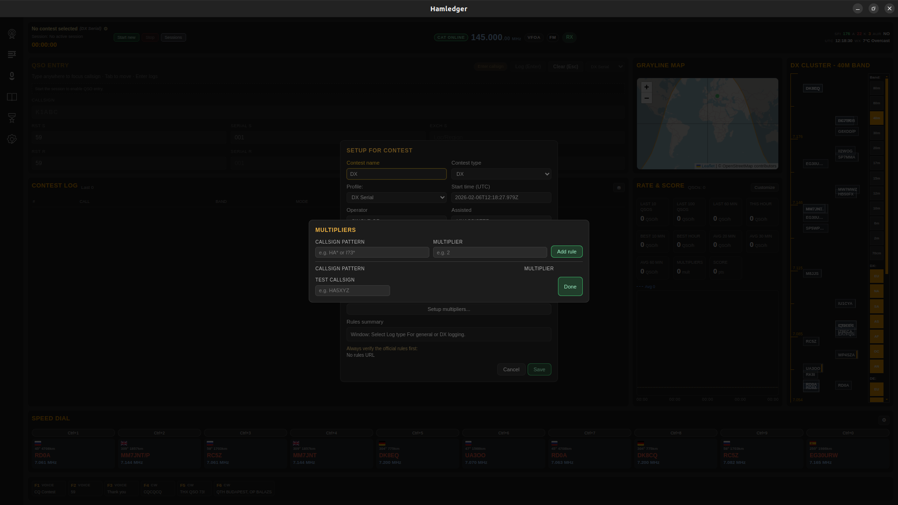
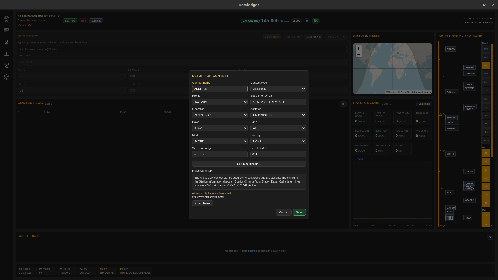
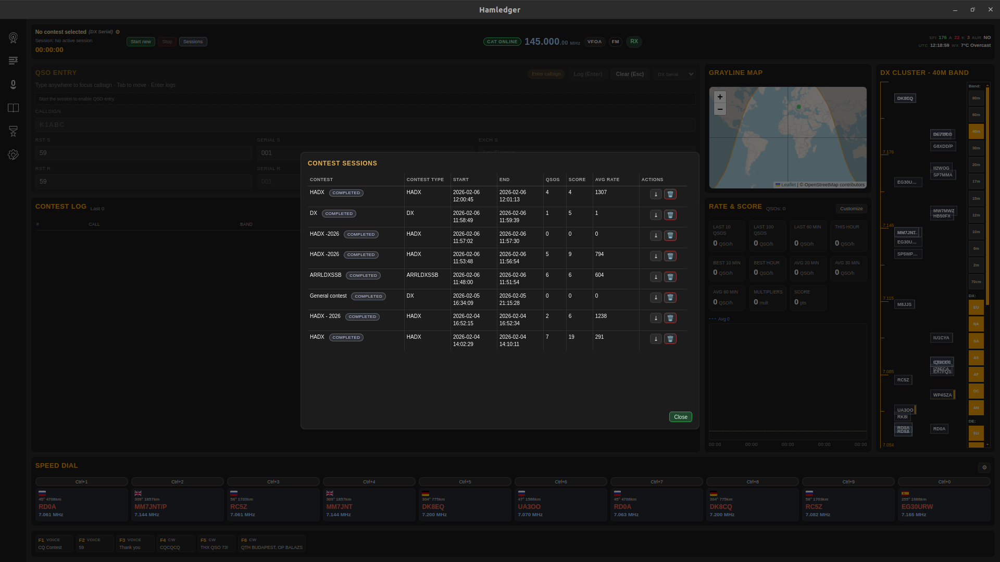

# Hamledger Tutorial (English)

## Overview

This guide walks you through Hamledger from first launch to advanced contesting, keying, and awards tracking. It is written as a practical operator manual with step‑by‑step workflows and screenshots.

---

## Table of Contents

1. [First Launch & Station Setup](#first-launch--station-setup)
2. [Main Screen Layout](#main-screen-layout)
3. [QSO Entry Workflow](#qso-entry-workflow)
4. [Remote Station Info](#remote-station-info)
5. [Rig Control (CAT)](#rig-control-cat)
6. [DX Cluster](#dx-cluster)
7. [Log Area & Filtering](#log-area--filtering)
8. [QSO Details](#qso-details)
9. [Awards](#awards)
10. [Contest Mode](#contest-mode)
11. [Speed Dial & Multipliers](#speed-dial--multipliers)
12. [Contest Sessions](#contest-sessions)
13. [Voice Keyer](#voice-keyer)
14. [CW Keyer](#cw-keyer)
15. [Hotkeys & Queueing](#hotkeys--queueing)
16. [Settings Reference](#settings-reference)
17. [Troubleshooting](#troubleshooting)

---

## First Launch & Station Setup

On first launch, complete the setup wizard so logging features can use your station info.

Minimum recommended:
- **Callsign**
- **QTH / Location**
- **Locator (Maidenhead)** for distance/azimuth
- **IARU region**

Optional:
- QRZ credentials for automatic station lookup
- Selected bands

---

## Main Screen Layout

The main view is built for fast operation:
- **QSO Entry** on the left
- **DX Cluster** on the right
- **Rig status + frequency** in the header
- **Log area** in the center

---

## QSO Entry Workflow

1. Type a callsign (auto‑uppercase).
2. Band/mode/frequency can auto‑fill from CAT.
3. Enter RST and exchange.
4. Press **Enter** to log (contest mode uses the same action).

Tips:
- Serial S / Serial R are always available in contest mode.
- Callsign suggestions appear after typing (match anywhere in the call).

---

## Remote Station Info

After entering a callsign, Hamledger fetches station details (QRZ + local cache):
- Country, QTH, grid
- Distance and azimuth
- Local time & weather (if available)

---

## Rig Control (CAT)

1. Open CAT settings.
2. Set **Rig model**, **port**, **baud**.
3. Connect.

Once connected:
- Frequency and mode update in real time.
- VFO/mode badges appear in the header.

---

## DX Cluster

DX Cluster highlights:
- Spots are placed by frequency.
- Hover highlights callsigns.
- Click to send the callsign into QSO entry.

---

## Log Area & Filtering

Log area features:
- Sorting by column
- Filters (via filter toggle)
- Click any row to open QSO details

---

## QSO Details

QSO details include:
- Full station data
- Map location
- Notes, remarks, QSL status

---

## Awards

Awards page highlights:
- Current progress by award type
- Detailed views per award
- Clear progress indication

---

## Contest Mode

Contest mode provides:
- Dedicated QSO entry layout
- Speed dial from DX cluster
- Multipliers and worked state handling
- Rate & score panel

---

## Speed Dial & Multipliers

Speed dial controls:
- Suggestion type (newest, multipliers, most active)
- Max cards and time limit

Multipliers:
- Add prefix/wildcard rules
- Highest multiplier applies per station
- Integrated into score calculation

---

## Contest Sessions

Contest session flow:
1. Configure contest setup (name, type, exchange).
2. Start session or auto‑start on first QSO.
3. View sessions list with statistics and exports.
4. Open session stats (map + QSO list).

---

## Voice Keyer

Voice keyer workflow:
- Record voice clips
- Build messages from clips
- Assign hotkeys
- Playback is queued (no overlap)

---

## CW Keyer

CW keyer:
- Record CW clips
- Build CW messages
- Winkeyer‑style workflow

---

## Hotkeys & Queueing

Hotkey strip shows assigned messages and playback status:
- **Active**: blinking border
- **Pending**: highlighted border

---

## Settings Reference

Important settings areas:
- Station identity and locator
- Rig configuration
- QRZ credentials
- Band selections

---

## Troubleshooting

Common fixes:
- CAT not connecting: verify rig model/port/baud, check Hamlib install.
- QRZ lookup fails: verify credentials in settings.
- Audio issues: verify OS input/output device in settings.

---

If you want any section expanded (e.g., WSJT‑X, ADIF import/export), tell me and I’ll extend it.
