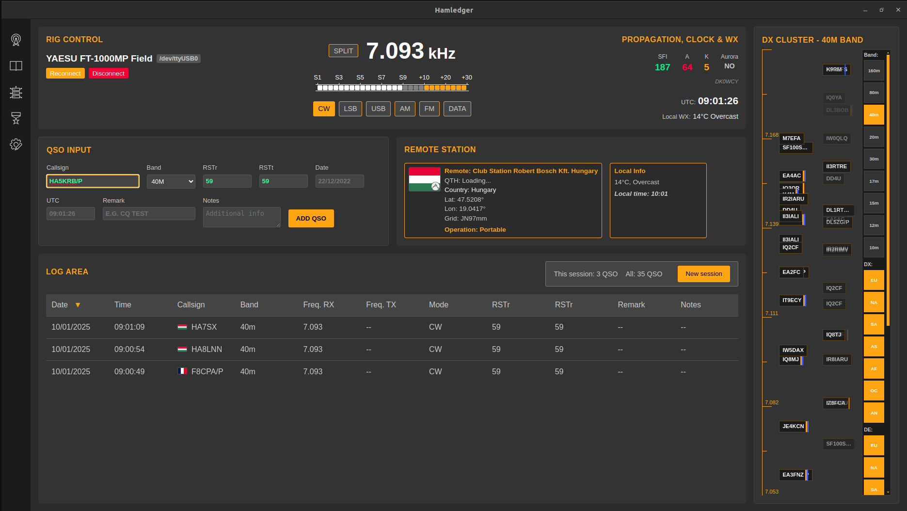
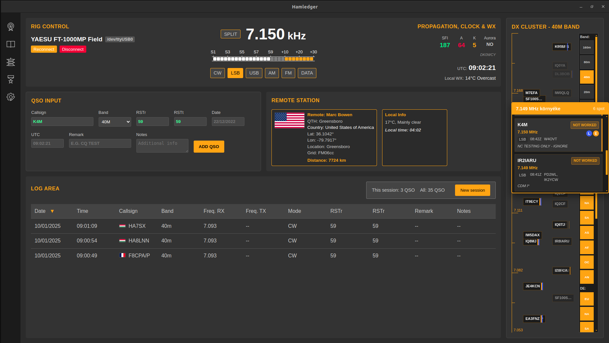
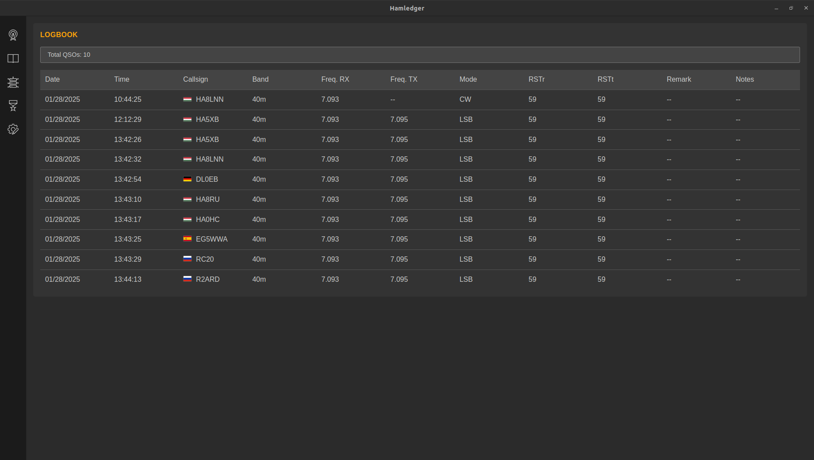
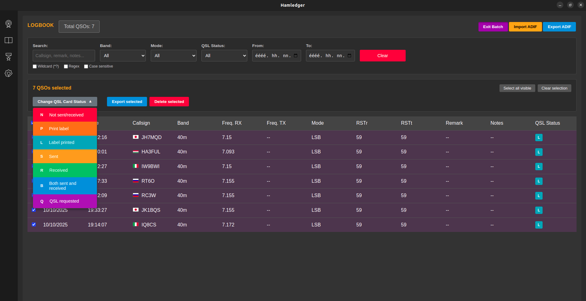
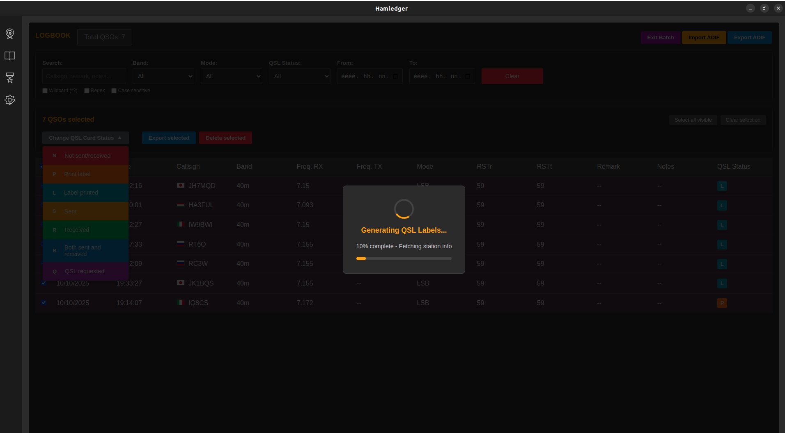

# HamLedger Tutorial - Complete Functionality Guide

## Development Status

**Important Note**: HamLedger is currently under development, but it's already fully suitable for everyday QSO logging. The core functions are stable and reliable, while some specialized features are still being fine-tuned.

## Table of Contents

1. [Introduction](#introduction)
2. [Initial Setup](#initial-setup)
3. [Main Screen Overview](#main-screen-overview)
4. [QSO Entry](#qso-entry)
5. [Remote Station Information](#remote-station-information)
6. [Rig Control (CAT Control)](#rig-control-cat-control)
7. [Frequency and S-Meter](#frequency-and-s-meter)
8. [Propagation Data, Clock and Weather](#propagation-data-clock-and-weather)
9. [DX Cluster](#dx-cluster)
10. [Log Area](#log-area)
11. [Logbook](#logbook)
12. [QSL Card Management](#qsl-card-management)
13. [ADIF Import/Export](#adif-importexport)
14. [WSJT-X Integration](#wsjt-x-integration)
15. [Configuration Settings](#configuration-settings)
16. [Awards and Statistics](#awards-and-statistics)
17. [Troubleshooting](#troubleshooting)

## Introduction

HamLedger is a modern, Electron-based amateur radio logging application that provides comprehensive functionality for QSO management, rig control, and DX cluster integration. The application offers an intuitive interface for amateur radio operators of all levels and is perfectly suitable for daily use.

### Main Features

- **Modern user interface**: Vue.js-based, responsive design
- **CAT Control**: Hamlib-based rig control
- **DX Cluster integration**: Real-time spot information
- **QRZ.com integration**: Automatic station information lookup
- **ADIF support**: Import/export functionality
- **QSL card management**: Automatic label generation
- **WSJT-X integration**: Digital modes support
- **Propagation data**: Real-time ionosphere information

## Initial Setup

### Setup Wizard

When starting the application for the first time, a 6-step setup wizard guides you through the configuration process. Each step requires only the necessary information, with the wizard automatically validating data and helping with correct settings.

#### Step 1: Station Information
Enter your callsign (automatically converted to uppercase) and QTH (e.g., Budapest, Hungary). This basic data is required for QSO logging and QSL card generation.

#### Step 2: Additional Information
Enter your Maidenhead locator (e.g., JN97) - this is optional but useful for distance calculations. Select the IARU region (1, 2, or 3) for proper band plan usage.

#### Step 3: Band Selection
Check the bands you want to operate on. Use the quick selection buttons ("All HF", "VHF/UHF", "Clear All") to easily set your preferences.

#### Step 4: ADIF Import
If you have an existing log, you can import it here in ADIF format. The progress bar shows advancement and you get detailed feedback on the import results.

#### Step 5: QRZ.com Configuration
Enter your QRZ.com username and password for automatic station information lookup. The data is stored securely and encrypted on the local machine.

#### Step 6: CAT Control Setup
On Windows systems, use the "Install Hamlib" button to automatically install required components. On Linux systems, follow the guide for package manager usage and dialout group setup.

## Main Screen Overview

### Navigation Sidebar

The left navigation sidebar provides four main views with simple icons. Click the appropriate icon to switch between views: QSO view (📡), Logbook (📖), Awards (🏆), and Settings (⚙️).

### Main Screen Layout

The QSO view is divided into three main areas for optimal workflow. The left column contains QSO entry fields and log area, the right column shows the DX Cluster, while the top header bar displays rig control and status information.

## QSO Entry

### Using Entry Fields

Enter the callsign in the top field - it automatically converts to uppercase and validates in real-time. If CAT control is active, band and frequency are automatically filled based on the rig's current settings.

#### RST Reports and Time Data
RST fields default to "59" for phone modes and "599" for CW. Date and time automatically refresh in UTC but can be manually modified if needed.

#### Adding Comments
You can enter short comments in the "Remark" field (e.g., "CQ Test") and more detailed information in the "Notes" field. These fields are optional but useful for later QSO identification.

### Adding QSO

Three simple methods are available for adding QSOs: click the "Add QSO" button, press Enter in the callsign field, or use WSJT-X automatic logging. After adding a QSO, the fields automatically clear for new QSO entry.

## Remote Station Information

### Automatic Information Lookup

After entering a callsign, the system automatically queries station data from QRZ.com and other sources with a 500ms delay. Information appears in the right panel, including name, address, grid locator, and QSL status.

### Geographic and Weather Data
The system automatically calculates distance and bearing to the remote station and displays local time and weather. If the callsign contains /P, /M, or /MM suffixes, the system recognizes portable operation.

### Troubleshooting
If QRZ.com lookup fails, the callsign field shows a red border indicating the problem. Check QRZ.com settings in the Settings menu or use the application in offline mode with local data.

## Rig Control (CAT Control)

### Setup and Connection

To set up CAT control, go to the Settings menu and select the rig model from the list. Enter the COM port (Windows: COM3, Linux: /dev/ttyUSB0) and click the Connect button to establish connection.

### Automatic Synchronization
After successful connection, HamLedger automatically follows the radio's frequency and mode. Changes made on the rig immediately appear in the application and automatically update the QSO entry fields.

### Troubleshooting
If connection fails, check that Hamlib is installed (Windows: automatic installation, Linux: `sudo apt install libhamlib-utils`). On Linux systems, add the user to the dialout group: `sudo usermod -a -G dialout $USER`.

## Frequency and S-Meter

### Frequency Display

The frequency appears in large digits in MHz and becomes an editable input field when clicked. By activating the SPLIT button, you can set a separate TX frequency that appears in parentheses.

### S-Meter Usage
The S-meter uses traditional S1-S9 scale with +20, +40, +60 dB indication above S9. Color coding changes from white to orange depending on signal strength and supports manufacturer-specific calibration.

### Mode Selection
Supported modes include LSB, USB, CW, and digital modes (DATA, FT8, FT4, PSK31). Mode can automatically switch based on frequency or be set manually.

## Propagation Data, Clock and Weather

### Propagation Information

Propagation data visible in the top bar shows real-time ionosphere information from WWV/WWVH sources. SFI (sunspot index), A-index, and K-index use color coding to indicate propagation conditions: green = good, orange = fair, red = poor.

### UTC Clock and Local Weather
Accurate UTC time appears with second-by-second updates for QSO logging. Local weather automatically updates based on Maidenhead locator, displaying temperature and weather conditions.

## DX Cluster

### Spot Display and Navigation

The DX Cluster uses a vertical frequency scale where each spot is positioned based on its exact frequency. Spots appear in two columns with age-based transparency, green borders indicate already worked stations.

### Magnifier Function and Filtering
Move the mouse cursor over a spot to display the magnifier window showing all spots within ±5 kHz range. Use the right filter panel to filter spots by band, continent (DX/DE), and mode.

### Spot Clicking and Integration
Click on a spot for automatic rig setup and callsign loading into the QSO form. The system automatically sets frequency, mode, and starts QRZ.com lookup to obtain station information.

## Log Area

### Current Session

The log area displays current session QSOs in tabular format with date, time, callsign, band, and mode columns. Country flags automatically appear next to callsigns, rows are clickable to open QSO details.

### Filtering and Sorting Options
Click column headers to sort the list, use the "Show/Hide Filters" button to open the filter panel. Filter by callsign, band, mode, or date range with wildcard (*,?) and regex support.

### Statistics
At the bottom of the log area, you can see the current session QSO count, total QSO number, and filtered results count. This helps track daily activity and log size.

## Logbook

### Complete Log Management

The Logbook view uses virtual scrolling for efficient display of large datasets in 50-QSO batches. Click any QSO row to open the detailed view showing all information about that QSO.

### Batch Operations
Activate multiple selection mode with the "Batch Select" button, which adds a checkbox column to each row. Use "Select all visible" and "Clear selection" buttons for quick selection, then perform bulk operations: QSL status change, export, or deletion.

### QSO Editing and Deletion
In the QSO details dialog, use the "Edit QSO" button to switch to edit mode where all fields are modifiable. The "Save Changes" button saves modifications, while the "Delete QSO" button permanently deletes the QSO after confirmation.

## QSL Card Management

### QSL Status System

The QSL status system uses simple letter codes and color coding to indicate QSL card status for each QSO. Status codes are: **N** (red) = no QSL, **P** (orange) = waiting for print, **L** (blue) = label printed, **S** (yellow) = QSL sent, **R** (green) = QSL received, **B** (blue) = both directions OK, **Q** (purple) = QSL requested. Left-click to advance forward, right-click to go backward through statuses - each click shows a tooltip with the current status meaning.

### Automatic Label Generation and PDF Printing
When you set the QSL status to "P" (Print label), HamLedger automatically offers QSL label PDF generation. The system queries the QRZ.com database for remote station data (name, address, country) and creates a professional QSL label with QSO details (date, time, frequency, mode, RST reports). After successful generation, the status automatically changes to "L" (Label printed).

### Batch Label Generation and Printing
In LogBook view, use "Batch Select" mode to select multiple QSOs for simultaneous label generation with efficient bulk processing. The system processes all selected QSOs, queries station data, and creates PDF labels. The progress bar shows real-time advancement (e.g., "Processing 15/50 QSOs"), and after completion, the "Open Folder" button opens the folder containing generated PDF files. Each PDF file is named based on callsign and date for easy identification.

## ADIF Import/Export

### Import Function

ADIF import is available from the Settings menu or during setup wizard for .adi and .adif files. Select the file with the native browser, preview shows QSO counts, then progress bar tracks real-time import.

### Export Function
In LogBook view, choose from three export options: complete log, filtered results, or selected QSOs in batch mode. The export dialog shows preview of QSO counts, then opens native file save dialog.

### ADIF Compatibility
HamLedger provides full ADIF 3.1.0 compatibility with UTF-8 encoding. Date exports in YYYYMMDD format, time in HHMMSS format, with all standard fields included.

## WSJT-X Integration

### Configuration and Activation

Enable WSJT-X integration in the Settings menu and set the UDP port (default 2237). The "Auto Log" option automatically logs confirmed QSOs, "Log Only Confirmed" records only complete QSOs.

### CAT Control Handover
Use the "Hand over to WSJT-X" button to transfer CAT control to WSJT-X, which automatically stops rigctld and starts the UDP listener. Blue status indicates WSJT-X mode is active.

### Automatic Logging and Recovery
WSJT-X automatically sends QSO data via UDP, which immediately appears in the HamLedger log. To recover CAT control, disable WSJT-X CAT function, then click the "Take back control" button.

## Configuration Settings

### Accessing Settings

The Settings menu (⚙️ icon) provides categorized configuration options. Each category helps with proper setup through real-time validation and error messages.

### Main Categories
In the Station category, set callsign, QTH, and grid locator. Configure rig model and COM port in the CAT Control section, and QRZ.com access in Online Services.

### Platform-Specific Help
Windows systems offer automatic Hamlib installation and firewall configuration. Linux systems provide detailed installation guides and sudo commands to help with setup, including dialout group configuration.

## Awards and Statistics

### Under Development

The Awards view currently shows "Not yet available" message as this feature is still under development. Future versions will include DXCC progress tracking, WAS and WAZ award calculations, and detailed QSO statistics.

### Planned Features
Planned features include country status tracking, award progress display in graphical format, and comprehensive statistics about QSO activity. This functionality will be available in later versions.

## Troubleshooting

### Common Problems

**CAT Control**: If "rigctld not found" error appears, check Hamlib installation and PATH settings. For "Connection refused", check port availability and firewall settings.

**QRZ.com Integration**: For authentication failed errors, check username/password pair and network connection. For rate limiting, reduce query frequency.

**WSJT-X Integration**: For UDP communication problems, check port conflicts and firewall settings. Make sure WSJT-X uses the same port.

### Diagnostics and Support

Open Developer Tools (F12) using Console and Network tabs to help diagnose errors. Settings and database files are located in the userData folder.

Find detailed documentation, bug reporting options, and community support in the GitHub repository. Features are continuously evolving, so it's worth checking for updates regularly.

---

*This tutorial covers the complete functionality of the HamLedger application. The application is currently under development but is fully suitable for everyday QSO logging.*
